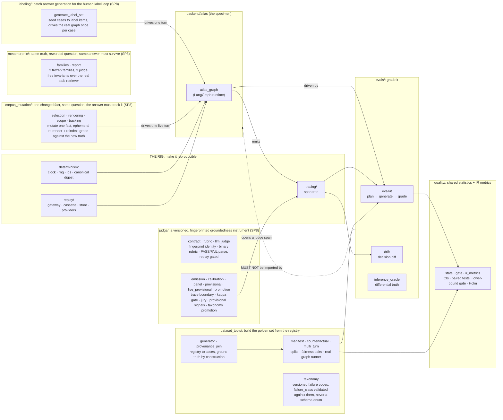
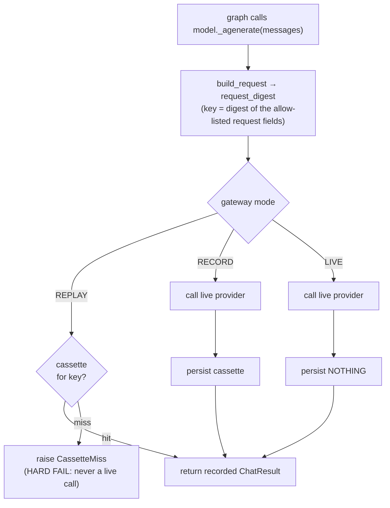
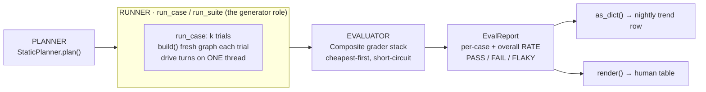
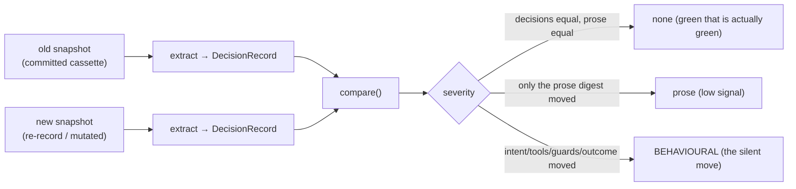
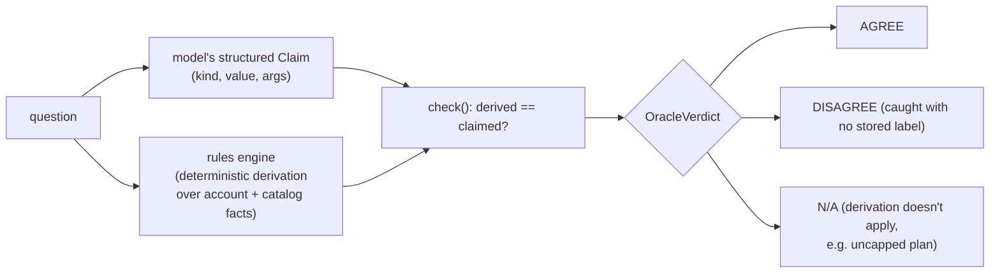
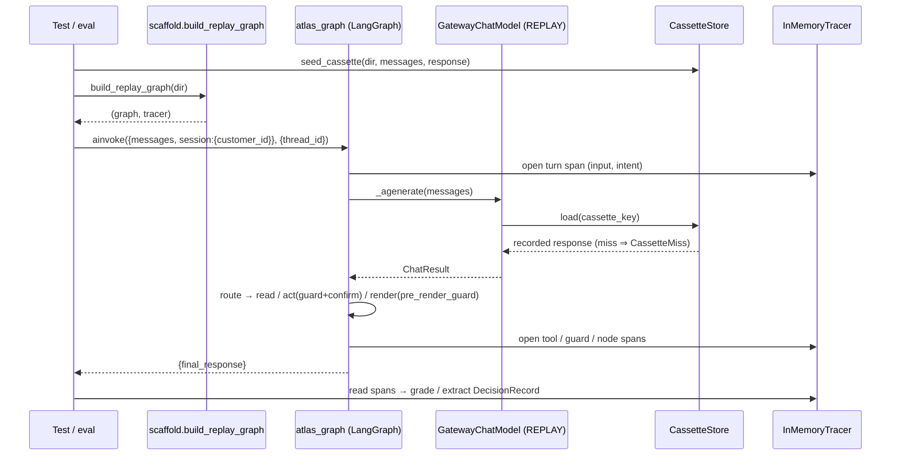

# The Atlas test harness

> The agent ("Atlas") is the specimen; this is the product. The harness turns a stochastic LLM
> agent into something you can run a thousand times and get the same bytes, then grade it.

This document is a high-level map of `testing/harness/`. For the *why* (the OWASP LLM / MITRE ATLAS
threat framing, the ADRs) see the companion series workspace, which lives outside this code repo;
this is the *how*. (MITRE ATLAS is the threat taxonomy, not Atlas the agent; the name collision is
unlucky.)

## Contents

- [1. Two machines, one seam](#1-two-machines-one-seam)
- [2. Directory map](#2-directory-map)
- [Glossary](#glossary)
- [3. The rig: three guarantees](#3-the-rig-three-guarantees)
  - [3.1 Determinism is a contract](#31-determinism-is-a-contract)
  - [3.2 The replay seam (the gateway)](#32-the-replay-seam-the-gateway)
  - [3.3 Tracing](#33-tracing)
- [4. The evals: grade the agent](#4-the-evals-grade-the-agent)
  - [4.1 The scored lane (evalkit)](#41-the-scored-lane-evalkit-the-three-agent-harness)
  - [4.2 The drift lane (drift)](#42-the-drift-lane-drift-the-fourth-gateway-reading)
  - [4.3 The inference oracle](#43-the-inference-oracle-inference_oracle-differential-truth)
  - [4.4 Honest numbers (stats)](#44-honest-numbers-stats)
- [5. End-to-end: one driven turn (REPLAY)](#5-end-to-end-one-driven-turn-replay)
- [6. The lanes (how you run it)](#6-the-lanes-how-you-run-it)

---

## 1. Two machines, one seam

The harness is two machines that meet at one interface (the agent's ports plus its trace):

| Machine | Question it answers | Verdict shape | Packages |
|---|---|---|---|
| **The rig** | "Did a *pinned* behaviour change?" | binary, gating, never flickers | `determinism/` · `replay/` · `tracing/` |
| **The evals** | "How *good* is the agent, and is it getting better or worse?" | a **rate** with intervals | `evals/` |

The rig is three packages with one job, reproducibility (§3); the evals are the second machine (§4).
The dependency points one way, and it is enforced: the product (`backend/atlas`) must never import
`evals/` ([`test_import_lint.py`](../tests/test_import_lint.py)).



**Backend additions (SP9), not diagrammed above on purpose** (the `PROD` box is deliberately one
node, "the specimen"; this document maps `testing/harness/`, not `backend/atlas/` file by file): two
narrow eval-subject subgraphs beside `atlas_graph` (`orchestration/agentic_rag.py`,
`orchestration/graph_rag.py`, D6's "identical signatures, selected by config"), the embedding port and
its two adapters (`ports/embedding.py`, `adapters/tei_embedding.py` / `openai_embedding.py`), the
Postgres graph adapter (`adapters/pg_knowledge_graph.py`, the registry-materialized GOLD graph behind
`ports/knowledge_graph.py`), and the pure `domain/graph_retrieval.py` entity-mention/chunk-join math.
None of these are graphed here; `matrix/` below (§2) is the harness-side caller that actually
measures the two variants, `matrix.variants`'s own module.

[↑ Contents](#contents)

---

## 2. Directory map

```
testing/harness/
  determinism/     pin every non-reproducible source + the digest everything is keyed by
    canonical.py     canonical JSON + sha256 digest (the cassette key & run digest contract)
    sources.py       FrozenClock · SeededRng · IdFactory · SpanSequence  (injected fixtures)
    checkpointer.py  a fresh in-memory LangGraph saver per test
  replay/          record the model once, replay it forever
    gateway.py       a LangChain BaseChatModel with 3 modes (REPLAY / RECORD / LIVE)
    cassette.py      typed, content-addressed shape of one recorded model call
    cassette_store.py  where cassettes live (file / in-memory); owns seed_cassette() (conftest + demos call it)
    providers.py     builds the live provider (Ollama / Anthropic / OpenAI); REPLAY needs none
  tracing/         the span tree each turn emits, the graders' substrate
  quality/         shared statistics + IR metrics (SP7 task 2, absorbed by relocation from evals/)
    stats.py         honest numbers: intervals (Wilson/Wald/bootstrap/BCa/cluster), paired tests, power, Cohen κ, Holm Bonferroni
    ir_metrics.py    deterministic IR metrics (Precision/Recall@k, Hit Rate, MRR, MAP, NDCG), trec_eval/BEIR convention
    gate.py          release gating on the interval's lower bound (variance budget + quarantine)
    graph_metrics.py graph-RAG failure modes as set arithmetic (entity resolution F1, triple F1, path recall); relocated from evals/retrieval/ (SP9 task 2)
  dataset_tools/   build the golden set from the registry (SP7): ground truth by construction, no annotation
    generator.py     registry to cases (one hop, two hop, contradictions, hallucination bait), deterministic
    provenance_join.py  join a fact's placement span to the chunk_ids that carry it (expected_doc_ids)
    manifest.py      dataset_manifest.json: seeded stratified splits, content hash, declared overlap + contamination lint
    counterfactual.py  D33 fairness pairs (persona varied, registry ground truth held equal)
    multi_turn.py    run a turns case through the real graph on a fresh in-memory checkpointer, gate on end state
    paraphrase.py    flag gated LLM phrasing volume (never runs in any gate)
    taxonomy.py      contracts/dataset/taxonomy.yaml loader (SP8 task 5): own semver, id uniqueness, failure_class checked by code, never a schema enum
  judge/           groundedness judge, calibration, and promotion (SP8): a versioned instrument, never a caller of its own gate
    contract.py      JudgeContract + fingerprint(): model id, rubric version, prompt template hash, one identity digest
    rubric.py        RUBRIC_GROUNDEDNESS: binary entailment rubric, template_hash pins the prompt text verbatim
    llm_judge.py     judge_label/order_swap/_parse_label (first standalone token); translate_verdict crosses PASS/FAIL to grounded/ungrounded
    emission.py      emit_verdict: the ONE call site opening a kind="judge" trace span and moving the pass/fail counters, fail closed
    calibration.py   AgreementRow/CalibrationReport/calibrate(): kappa + CI against real human labels, licensed via quality.gate.gate_on_lower_bound
    panel.py         panel_vote: a jury of judges, ties fail closed to label 0 (caller: matrix/generators.py, SP9 task 4)
    provisional.py   manufactured registry contradictions (n=4): registry truth agreement + judge vs judge kappa, neither ever licenses a deployment
    live_provisional.py  `task judge-live`: the live sweep entrypoint against provisional's manufactured set, cheapest tier first per provider
    promotion.py     taxonomy gated promotion: judge fail spans + thumbs down feedback joined and promoted into origin: promoted dataset cases
  labeling/        the human loop's batch answer generator (SP8 task 4)
    generate_label_set.py  seed cases to label items: drives the real graph once per case, `task label:generate` / `label:generate-live`
  metamorphic/     same underlying truth, reworded question, same answer must survive (SP8 task 6, D32)
    families.py      3 frozen families (paraphrase, typo noise, query perturbation) seeded from conflict-daniel-contract
    report.py        3 deterministic, judge free invariants (id agreement, rank overlap floor, answer equivalence) over the real stub retriever
  corpus_mutation/ one registry fact changed, same question, the answer must track the new truth (SP8 task 7, D32)
    selection.py     select_mutation/mutate_registry: one fact changed on a throwaway registry copy, deterministic
    rendering.py     writes only the affected documents into an ephemeral corpus dir via a real render_corpus call, live/burst only
    scope.py         EphemeralCorpusVersion: a content addressed name that can never collide with a committed corpus-X.Y.Z, guaranteed cleanup
    tracking.py      answer_tracks_mutated_truth: the new truth vs the stale (parametric/cached) value vs simply wrong, via quality.agent_metrics
  evals/           the OTHER machine: grade the agent (imports quality/ for its numbers)
    scaffold.py      build_replay_graph(), one definition of the REPLAY wiring
    evalkit/         the scored lane: case · planner · runner · graders · report
    drift/           diff DECISIONS old-vs-new behind a stable request key
    inference_oracle/  grade derived truth (no stored label) by two computations
  matrix/          SP9 task 4: the staged benchmark matrix runner (embedders -> rerankers -> generators), wired to quality/ + judge/panel.py
    runner.py        run_matrix: assembles the manifest + per query files; the spend gate's and the variant comparison stage's own caller
    embedders.py · rerankers.py · generators.py  the three staged axes, each a seeded fixture hermetically, a live adapter swap deferred
    cases.py         the 55 case retrieval relevant slice of the committed seed set; query_entity_ids derived from the registry's own expected_facts
    variants.py      SP9 final review (I1): naive vs agentic vs graph RAG, measured over the same cases with the same quality/ metrics
    spend_gate.py    SP9 task 5: cumulative per provider dollar ceiling; refuses a zero/unknown estimate against a paid provider, never silently admits it
    cache.py · chunks.py · compare.py · cost_emission.py · lineage.py · select.py  content hash cache, chunk (de)serialization, paired stats wiring, cost span emission, D26 lineage rows, top config selection
    ollama_generator.py · ollama_spot_check.py  SP9 task 7: the local vLLM substituted arm + its HITL spot check
  load/            SP9 task 6: the burst latency lane (k6 SSE script, live only) + its 3 Python side helpers, hermetically gated by 46 tests
    k6/chat_sse_load.js  the k6 script itself: per stage latency, goodput as a Rate
    prompt_corpus.py · thresholds.py · phoenix_join.py  the shared fixed prompt corpus/thresholds two readers use, and the real atlas.turn.seq based Phoenix export join
  recording/       operator scripts that capture new cassettes against a LIVE model (need keys)
  cassettes/       committed recorded responses the lanes replay (data, not code)
    atlas/  e2e/
```

The whole layout is **pythonpath, not installed** (`pyproject` → `pythonpath = ["backend",
"testing/harness", "."]`), so the import-lint layers stay physical: `determinism`, `replay`,
`tracing`, `quality`, `evals` resolve as top-level packages.

[↑ Contents](#contents)

---

## Glossary

One-line anchors for the terms the rest of the doc leans on.

| Term | Meaning |
|---|---|
| **Rig** | `determinism` + `replay` + `tracing`: the half that makes the agent reproducible. |
| **Evals** | the half that grades the agent (`evalkit`, `drift`, `inference_oracle`), reading its numbers from `quality` (`stats`, `gate`, `ir_metrics`). |
| **Seam** | the one interface the two halves meet at: the agent's ports plus its trace. |
| **Cassette** | one recorded model call, stored under a content-addressed key; REPLAY serves these instead of calling a model. |
| **Lane** | a way to run the suite (a `task`): the REPLAY PR gate, RECORD, LIVE nightly, or a committed demo (§6). |
| **Decision vs prose** | what a turn *did* (intent, tools, guards, outcome) vs what it *said* (shipped text). Drift compares decisions; prose is kept apart as a digest. |
| **Run digest** | the sha256 of a run's canonical JSON. "Same bytes" means this digest is stable. |
| **Proxy drift** | the live model moving while its cassette (a frozen proxy) does not, so REPLAY stays green on stale behaviour. |

[↑ Contents](#contents)

---

## 3. The rig: three guarantees

### 3.1 Determinism is a contract

The agent has exactly one legitimate source of non-determinism: the model call. Everything else is
pinned, so the only thing that can differ between two runs is the thing under test.

- **No wall clock, no `random`, no unordered iteration** in runtime paths.
- Time / ids / rng / span-order come from **injected factories**
  ([`determinism/sources.py`](determinism/sources.py)): `FrozenClock`, `SeededRng`, `IdFactory`,
  `SpanSequence`. Dev/prod inject real ones at the same call sites (duck-typed, no base class).
- The **canonical digest** ([`determinism/canonical.py`](determinism/canonical.py)) turns any value
  into canonical JSON (sorted keys, money as normalized `Decimal`, dates as ISO 8601) → sha256. This
  is the cassette key *and* the run digest, so "run a thousand times, get the same bytes" means
  exactly this digest holds steady. Changing canonicalization invalidates cassettes on purpose.

### 3.2 The replay seam (the gateway)

The gateway is a drop-in LangChain `BaseChatModel`, so nothing upstream in the graph knows it is
being recorded. Three modes, the seam between the two machines:



- **REPLAY**: the PR lane. Cassette only, zero egress, zero keys; a miss is a hard failure. (By CI
  config the PR lane does not install the `record` dependency group, so a stray call has no client to
  make it.)
- **RECORD**: operator-run (`recording/`). Call live **and** persist, so REPLAY has something.
- **LIVE**: the nightly eval lane. Call live, persist nothing (the eval measures the *live* model).

The key contract cannot drift: [`cassette.build_request`](replay/cassette.py) copies exactly the
fields `canonical.REQUEST_ALLOW` hashes (the allow-list of request fields, asserted by a test).
Responsibilities are split: cassette shape in [`cassette.py`](replay/cassette.py), where it lives in
[`cassette_store.py`](replay/cassette_store.py), mode policy in [`gateway.py`](replay/gateway.py).

### 3.3 Tracing

Every turn emits a tree of `Span`s (`turn / llm / tool / guard / node`), ordered by a monotonic
`SpanSequence` (never the frozen clock: all spans would tie). Guard verdicts are the agent's own
domain logic, so guard nodes annotate spans explicitly (e.g. `ok=True/False`, `intent=…`,
`applied=…`). The default tracer is `NullTracer`, so runtime code never depends on being observed;
`InMemoryTracer` is the CI adapter you assert against. Shared decoders (`spans_of_kind`,
`tool_names`, `guard_outcomes` in [`tracing/`](tracing/__init__.py)) are the single definition of
"the trajectory" by convention: the tracer methods and the eval lanes both import them rather than
re-deriving it.

[↑ Contents](#contents)

---

## 4. The evals: grade the agent

Two of the three eval lanes (`evalkit`, `drift`) drive the agent through one hermetic wiring,
[`build_replay_graph`](evals/scaffold.py)`(cassette_dir)` → `(graph, tracer)`: a REPLAY gateway,
deterministic id factories, a fresh checkpointer, and a pristine account seed per call. The inference
oracle (§4.3) is the exception: it grades domain derivations directly and drives no graph.

### 4.1 The scored lane (`evalkit`): the three-agent harness

Three roles kept separate, so no agent marks its own exam: a **planner** (`StaticPlanner`) designs
the cases, a **generator** (`run_case` driving the graph) produces the runs, an **evaluator** (the
`Composite` grader stack) grades them. "Generator" is a role, not a class; the code path is
`run_case` → the graph.



- **`EvalCase`** is pure data: `turns`, `customer_id` (identity rides the non-model `session`
  channel, never a tool arg), `risk`, and declared `graders` by name.
- **`run_case(case, build, graders, k)`** drives the case `k` times. On REPLAY every trial is
  identical, so the rate is 0 or 1 (this proves the *wiring*); variance only appears on LIVE. All
  turns of a case run on **one** `thread_id`, so a multi-turn case is a real conversation under the
  checkpointer.
- **Grader stack**: `Composite` runs graders cheapest-first and short-circuits at the first hard
  fail. `GradeContext` is what every grader reads: `final_response` plus the `trace` (read-only).
- **`run_suite`** resolves each case's declared graders against a `{name: Grader}` registry (a
  mixed-risk suite grades each case with only the rules it names), or applies a flat list uniformly.
- **A rate, never a verdict — and never bare**: a case that passes 7/10 is a known coin-flip; the
  same case run once and passing is a landmine labelled safe. Every rate the report serializes
  carries its Wilson 95% interval (a reporter-lint meta-test walks the trend row and fails any
  bare point estimate), and `EvalReport.gate()` gates the tracked rate on the interval's floor,
  never the point.

### 4.2 The drift lane (`drift`): the fourth gateway reading

Drift is a fourth *use* of the gateway seam, not a fourth mode beside REPLAY/RECORD/LIVE. REPLAY
pins a *proxy* of the model and never re-checks it: when a provider silently moves the model behind a
stable version string, the request bytes stay identical, replay returns last quarter's response
forever, and the suite stays green on a stale proxy. The drift lane re-runs the pinned agent against
a new snapshot and diffs the decisions, not the prose.



A `DecisionRecord` separates what a turn decided from what it said:

- `intent` / `tools` / `guards` / `outcome`: the decisions, all read **structurally from the
  trace** (outcome from the `execute_action`/guard spans, not by parsing English).
- `claim_digest`: the shipped prose, kept apart as a digest. A reworded-but-equivalent answer
  (prose drift) never masquerades as a changed decision (behavioural drift). The four decision field
  names live once, in `DECISION_KEYS`, which `compare()` iterates so the diff cannot fall out of sync.

### 4.3 The inference oracle (`inference_oracle`): differential truth

The shipped lookup oracle checks a claimed value against a **stored column**: the easy half of
"true". The expensive failures are **inference-truth**: derivations over several facts plus policy,
with no column to read ("am I over my allowance?", "what does switching cost?").



Differential / metamorphic testing applied to the oracle problem: compute the truth twice (a trusted
rules engine vs the model's claim) and flag disagreement, catching a plausible-but-wrong derived
answer **without** a pre-stored label. A `None` derivation (question not applicable) is its own N/A
verdict, never a false DISAGREE.

### 4.4 Honest numbers (`stats`, `gate`)

A rate is only as honest as its interval. [`stats`](quality/stats.py) turns a pass count into a
**Wilson confidence interval**, scores judge↔human agreement with **Cohen's κ** (raw agreement
flatters; κ discounts chance), and carries the rest of the statistics-article toolbox: seeded
percentile and **BCa** bootstraps for metrics with no clean SE, a **cluster bootstrap** that
resamples whole conversations (turns are correlated), the **paired** tests that belong on
same-items comparisons (paired bootstrap, permutation, exact McNemar), **power sizing**
(`required_n` / `detectable_effect`, so an underpowered suite's silence is named blindness, not
a pass), **Holm Bonferroni** multiple comparison correction, and the within-/between-item
**variance decomposition** for multi-trial runs.
[`gate`](quality/gate.py) is where the numbers meet a release: gate on the interval's **lower
bound**, never the point, with a **variance budget** (too wide is an unproven claim) and a
**quarantine** verdict (rerun, don't ship a coin flip). The lanes report the rate; `stats` is
what makes "is it getting better or worse?" answerable rather than anecdotal. Both are shared
machinery, not lanes of their own, so they have no `__main__`.

[↑ Contents](#contents)

---

## 5. End-to-end: one driven turn (REPLAY)



The graph's terminal paths all set `final_response` (render / confirm / a fail-closed handoff), so
that one channel is the authoritative "what shipped" the evals grade, and the span tree is the
authoritative "what it did".

[↑ Contents](#contents)

---

## 6. The lanes (how you run it)

| Task | Mode | Keys? | What it is |
|---|---|---|---|
| `task test` | REPLAY | none | the PR gate: hermetic, deterministic, the suite in `testing/tests/` |
| `task cov` | REPLAY | none | same suite + coverage (risk-scoped omit list) |
| `task eval` | REPLAY (demo) | none | `python -m evals.evalkit`, the scored lane proving its own wiring |
| `task drift` | REPLAY (demo) | none | `python -m evals.drift`, decision diff across mutated snapshots |
| `task oracle` | no graph | none | `python -m evals.inference_oracle`, differential truth, pure domain reads |
| `task record-demo` · `record-atlas` · `seed-e2e` | RECORD | yes | operator scripts in `recording/` that regenerate `cassettes/` |
| LIVE eval / shadow drift | LIVE | yes | nightly, deferred: needs keys + the `record` group |

A **demo** lane is a committed, runnable example: it proves the lane's wiring on REPLAY with no keys.
`task drift` therefore exercises *mutated* committed cassettes, not a real provider move; the live
shadow re-record that catches an actual move needs keys and the `record` group, and is deferred.

**The invariant that ties it together:** the rig (determinism + replay + tracing) makes the agent
reproducible; `evals/` measures it; the dependency points one way, and `customer_id` always comes
from the session, never the model.

[↑ Contents](#contents)
